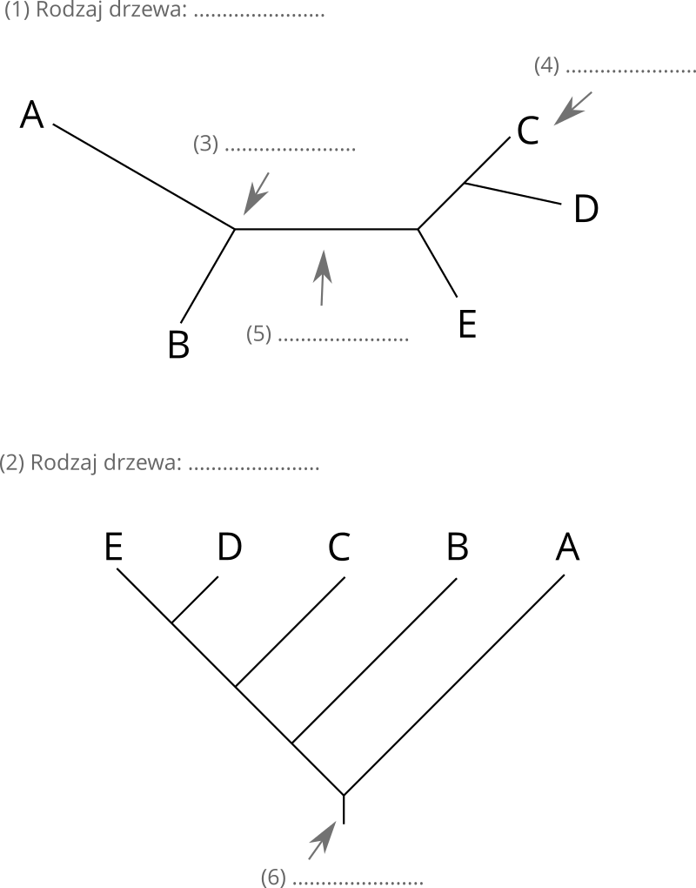
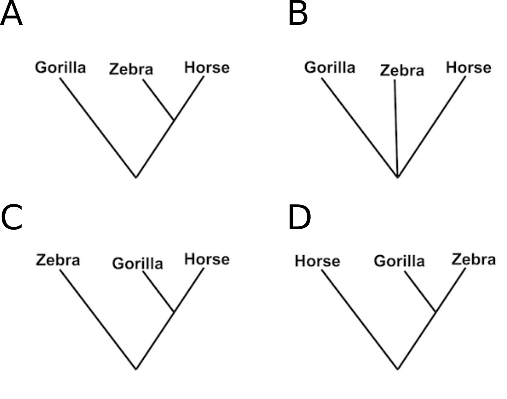

## Przyrównanie wielu sekwencji (MSA)


### Zad. 1
W pliku [myoglobins.fasta](http://www.combio.pl/files/myoglobins.fasta) znajdują się sekwencje białkowe mioglobiny z 14 gatunków kręgowców. Wykonaj dopasowanie tych sekwencji przy pomocy lokalnie zainstalowanego programu ClustalOmega. Uzyskane przyrównanie umieść w sprawozdaniu.

```bash
clustalo -i myoglobins.fasta --outfmt=clu -o myoglobins.aln
``` 

1. Podaj najdłuższy region o nieprzerwanej stuprocentowej identyczności.
2. Wykonaj poniższe polecenie w celu obliczenia dystansów między sekwencjami.

   ```bash
   clustalo -i myoglobins.fasta --outfmt=clu -o myoglobins.aln --full --distmat-out=dist.txt
   ```

   Między którymi parami sekwencji jest najmniejszy dystans i ile wynosi?

3. Wykonaj poniższe polecenie w celu obliczenia poziomu identyczności między sekwencjami. Ile wynosi identyczność sekwencji aligatora i goryla?

   ```bash
   clustalo -i myoglobins.fasta --outfmt=clu -o myoglobins.aln --full --distmat-out=dist.txt --percent-id
   ```

4. Wyświetl pomoc programu (`clustalo -h`) i utwórz polecenie, aby wyświetlić uzyskane przyrównanie w formacie FASTA. Podaj polecenie.


### Zad. 2
Wykonaj przyrównani sekwencji z poprzedniego zadania używając programu MAFFT i zapisując wynik w formacie `clustal` (`mafft -h`). Uzyskane przyrównanie umieść w sprawozdaniu.

1. Podaj użyte polecenie.
2. Opisz krótko czym różnią się przyrównania uzyskane programem ClustalOmega i MAFFT.


## Podstawowe pojęcia z filogenetyki

### Zad. 3

1. Podpisz rysunek (rodzaj drzewa i co jest na nim zaznaczone)
   > Przeczytaj: [Tree terminology](https://www.ncbi.nlm.nih.gov/Class/NAWBIS/Modules/Phylogenetics/phylo7.html).

<p align="center"></p>

2. Na czym polega różnica w interpretacji między drzewem nieukorzenionym a ukorzenionym?
   > Przeczytaj: [The difference between rooted and un-rooted phylogenetic tree](https://brainly.in/question/3769990).

### Zad. 4

Przedstawione poniżej drzewo nieukorzenione można przekształcić w 5 drzew ukorzenionych w zależności od miejsca lokalizacji korzenia (miejsca te są zaznaczone cyframi).

<p align="center"></p>

Przykład takiego drzewa, w którym korzeń umieszczony jest przy odgałęzieniu 1 przedstawiony jest poniżej:

<p align="center"></p>

1. Narysuj pozostałe możliwości drzew ukorzenionych (umieszczając korzeń w 2, 3, 4, 5).


#### Przestrzenie drzew

Liczba możliwych drzew dla różnej liczby sekwencji.

```
Liczba sek. (N)   Drzewa nieukorzenione   Drzewa ukorzenione
5                 15                      105
6                 105                     945
7                 945                     10 395
8                 10 395                  135 135
N                 (2N - 5)!!              (2N - 3)!!
```

Na przykład, dla 9 sekwencji (*N* = 9) liczba możliwych drzew nieukorzenionych jest równa:

```
(18 - 5)!! = 13!! = 1 * 3 * 5 * 7 * 9 * 11 * 13 = 135 135
```

2. Ile istnieje drzew nieukorzenionych i ukorzenionych dla 10 sekwencji?


### Zad. 5

Poniższe drzewa są nieukorzenione, a długości ich gałęzi nie odpowiadają odległości ewolucyjnej.

<p align="center"></p>

Które drzewa są ze sobą równoważne?


### Zad. 6
> Przeczytaj: [Difference Between Monophyletic Paraphyletic and Polyphyletic](https://www.differencebetween.com/difference-between-monophyletic-and-vs-paraphyletic-and-vs-polyphyletic/).

1. Przyporządkuj grupy taksonów (monofiletyczny, polifiletyczny, parafiletyczny) do odpowiedniego drzewa poniżej.


2. Podaj po jednym przykładzie biologicznym dla każdej z grupy.


### Zad. 7
Poniższa tabela przedstawia cztery aminokwasy wśród trzech gatunków.

````
Gorilla   Lys - Glu - His - Lys
Horse     Arg - Lys - His - Lys
Zebra     Arg - Lys - His - Lys
````

Które drzewo najodpowiedniej opisuje relację między powyższymi gatunkami.

<p align="center"></p>


## MEGA
Zainstaluj program MEGA (Molecular Evolutionary Genetic Analysis): [https://www.megasoftware.net](https://www.megasoftware.net).

### Zad. 8 - Pochodzenie niedźwiedzia polarnego i pandy wielkiej.

W pliku [bears.fasta](http://www.combio.pl/files/bears.fasta) znajdują się sekwencje 12s rRNA (niekodujące białka) pochodzące z 7 gatunków niedźwiedzi i 4 gatunków innych kręgowców:

1. American Black bear
2. American Brown bear
3. Asiatic Black bear
4. Spectacled bear
5. Polar bear
6. Giant panda
7. Red panda
8. Dog
9. Racoon
10. Crocodile skink
11. Cow

---


#### 8.1 Dopasowanie sekwencji

* Otwórz program MEGA.
* Otwórz w programie sekwencje znajdujące się w pliku `bears.fasta`.
   * `Align` > `Edit/Build Alignment` > `Retrieve sequences from a file`.
* Zaznacz wszystkie sekwencje (Ctrl+A lub `Edit` > `Select all`) i przeprowadź ich dopasowanie (`Alignment` > `Align by ClustalW`) korzystając z domyślnych ustawień.


1. Jaka jest długość dopasowania?


#### 8.2 Analiza filogenetyczna

* W oknie dopasowania sekwencji wybierz z menu wybierz `Data` > `Phylogenetic Analysis` (sekwencje nie kodują białka).
* W głównym oknie programu MEGA wygeneruj drzewo używając algorytmu *Neighbor-Joining (NJ)* 
   * `Analysis` > `Phylogeny` > `Construct Neighbor-Joining tree`.
* W opcjach `Test of Phylogeny` ustaw `None`.
* Naciśnij przycisk `OK`.


2. Wymień dwie "pary niedźwiedzi", które są ze sobą najbardziej spokrewnione?
3. Które niedźwiedzie są ze sobą bardziej spokrewnione: 
   * American Black Bear - Asia Black Bear 
   * American Black Bear - American Brown Bear?

Ustaw korzeń drzewa na gałąź `Crocodillian skink (outgroup)`, wyświetl drzewo w pełnej wielkości okna (`Autosize the tree`) i wyświetl długości gałęzi (`Display of branch lengths`).

4. Czy panda wielka jest bardziej spokrewniona z niedźwiedziami amerykańskimi czy azjatyckimi?
5. Czy Red Panda jest w ogóle niedźwiedziem?
6. Które niedźwiedzie są najstarsze?


### Zad. 9
Sekwencje z poprzedniego zadania należą do żyjących gatunków niedźwiedzi. Niedźwiedź jaskiniowy (*Ursus spelaeus*) wymarł ok. 20 tys. lat temu. Wybierz dowolną sekwencję 12s rRNA z pliku `bears.fasta`, użyj jej jako sekwencji zapytania w programie BLAST i zidentyfikuj sekwencję 12s rRNA niedźwiedzia jaskiniowego. W wynikach programu BLAST otwórz rekord znalezionej sekwencji, następnie wyszukaj w rekordzie `/gene="12S rRNA"` i wyświetl sekwencje tego genu w formacie FASTA. Następnie znalezioną sekwencję dołącz do sekwencji pozostałych gatunków w pliku `bears.fasta` i zbuduj drzewo filogenetyczne.

1. Który niedźwiedź jest najbliższym krewnym wymarłego niedźwiedzia jaskiniowego?
2. Czy dołączenie niedźwiedzia jaskiniowego zmieniło układ pozostałych taksonów na drzewie?


### Zad. 10 (Ocena wiarygodności drzewa: metoda *bootstrap*)
> Bootstrap jest metodą statystyczną, która opiera się na tworzeniu dużej liczby replik z niewielkimi zmianami w danych początkowych. Drzewa skonstruowane ze zbiorów danych z wprowadzonymi losowymi zmianami dają rozkład topologii drzew, który umożliwia statystyczną ocenę każdego pojedynczego kladu z danego drzewa.
> Wykorzystanie metody bootstrap do oceny wiarygności skonstruowanego wcześniej drzewa filogenetycznego obejmuje wygenerowanie wielu dopasowań sekwencji (zazwyczaj między 100 a 1000). Dla każdego z wygenerowanych dopasowań jest wyznaczane drzewo filogenetyczne. W zbiorze takich drzew niektóre drzewa będą miały taką samą topologię, jak drzewo oryginalne. Inne będą się od niego różnić. Każdemu z węzłów w oryginalnym drzewie jest następnie przypisywana tzw. wartość bootstrap równa odsetkowi wygenerowanych drzew, w których obserwowano dokładnie takie samo rozgałęzienie linii ewolucyjnych.
> Nie ma ustalonej reguły, która mówiłaby jak duża musi być wartość bootstrap, aby uznać odpowiedni węzeł drzewa za wiarygodny, a tym samym uznać, że gatunki, których linie ewolucyjne się w nim zbiegają, tworzą klad. W praktyce przyjmuje się, że wartości powyżej 70% takie twierdzenie usprawiedliwiają.

Utwórz drzewo sekwencji niedźwiedzi z poprzedniego zadania korzystając z algorytmu Neighbor-Joining i zaznaczając `Test of Phylogeny`: `Bootstrap method` (No. of Boostrap Replications): `1000`.

1. Co oznaczają liczby znajdujące się na węzłach uzyskanego drzewa?
2. Czy na drzewie znajdują się grupy sekwencji o niskim poziomie ufności?
3. Które rozgałęzienia na drzewie są najbardziej wiarygodne.
4. Obejrzyj drzewo w zakładce `Bootstrap consensus tree`. Czy układ organizmów na drzewach `Original Tree` i `Consensus Tree` jest taki sam?
   > `Original tree` jest drzewem zbudowanym na oryginalnym przyrównaniu sekwencji. Natomiast `Bootstrap consensus tree` jest drzewem konsensusowym zbudowanym w oparciu o wszystkie repliki drzew, które zostały wygenerowane podczas testu bootstrap. Drzewo takie jest złożone z kladów, które występowały najczęściej w replikach.

Oblicz dystanse między wszystkimi parami sekwencji niedźwiedzi (`Analysis` > `Distance` > `Compute Pairwise Distance`)

5. Która para sekwencji odznacza się największym/najmniejszym dystansem?

Ponownie oblicz dystans między sekwencjami stosując jako model substytucji: `Kimura 2-parameter model`.

6. Ile wynosi dystans między `Spectacled Bear` a `Polar Bear`.


### Zad. 11 (Algorytmy grupowania)
W programie MEGA wykonaj drzewo filogenetyczne sekwencji z poprzedniego zadania w oparciu o poniższe algorytmy, stosując metodę bootstrap z 100 pseudoreplikacjami.

* największej wiarygodności (Maximum Likelihood Tree)
* minimalnej ewolucji (Minimum-Evolution Tree)

Czy drzewa uzyskane tymi metodami pozwalają wyciągnąć podobne wnioski na temat spokrewnienia niedźwiedzi, co w przypadku drzewa otrzymanego metodą NJ?


### Zad. 12 (Drzewo genów)
W pliku [tnrc6.fasta](http://www.combio.pl/files/tnrc6.fasta) znajduje się 17 sekwencji białkowych genu TNRC6 pochodzących z bezkręgowców i kręgowców. W programie MEGA utwórz drzewo filogenetyczne tych sekwencji korzystając z algorytmu Neighbor-Joining i metody boostrap (1000 replikacji). Ustaw korzeń drzewa na sekwencji muchy.

1. Wymień organizmy zawierające jedną kopię genu TNRC6.
2. Ile kopii genu TNRC6 ma człowiek?
3. Kiedy w toku ewolucji gen TNRC6 uległ duplikacjom?
4. Czy podrodzina genu TNRC6A jest bliżej spokrewniona z podrodziną TNRC6B czy TNRC6C?
5. Czy na drzewie są duplikacje/delecje genu, które są specyficzne dla danego organizmu.
6. Które pary sekwencji są bliżej spokrewnione: ortologi TNRC6C człowieka i szympansa czy paralogi TNRC6C kury?
7. Z którym genem ryby (TNRC6A, TNRC6B, TNRC6C) jest najbliżej spokrewniona sekwencja lancetnika.
8. Czy według uzyskanych wartości bootstrap wszystkie rozgałęzienia drzewa są wiarygodne?